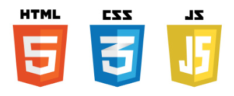

# Client Side

  

## 📕 HTML CSS JavaScript

## 공부한 내용

### 1️⃣ w3scools.com

- HTML
- CSS
- JavaScript  

실습하고 정리한 [pdf](1.w3school-example/HTML-CSS-JavaScript.pdf)

---

### 2️⃣ 소개 page 제작하기

정리한 [pdf](2.introduce-me-site/Introduce-WebPage.pdf)

---